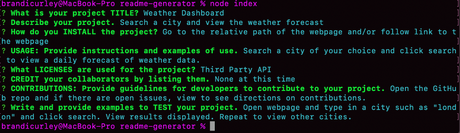

# README-generator

# Description
Use the command line terminal to dynamically generate a professional README file from the user input entered into the terminal. 

## Table of Contents 

* [Installation](#installation)
* [Usage](#usage)
* [Credits](#credits)
* [License](#license)

# Installation
On the main page of the github repo, click the green code button to git clone the repo to your local computer through the command line terminal. The node modules should already be downloaded files in the application, but you must ensure to install node.js to your platform through the command line terminal.

# Usage 
Once you have cloned the repo, you can then begin the user input process by typing 'node index' or 'node index.js' into the terminal while you are in the main project directory. After initiating the app, follow the prompts and enter text inputs. If you do not provide input, you will receive an error message indicating you must provide a response. Once all of the prompts have been answered in the terminal, you will then open your code editor to view the README.md file that was created in the designated folder. 

# Credits
There are no collaborators at this time.

# License
Node.js and NPM inquirer

## Video link of application example
https://drive.google.com/file/d/1zhgLv-Zd8mXssgI3tnfTn6uHlueWO5Dc/view
